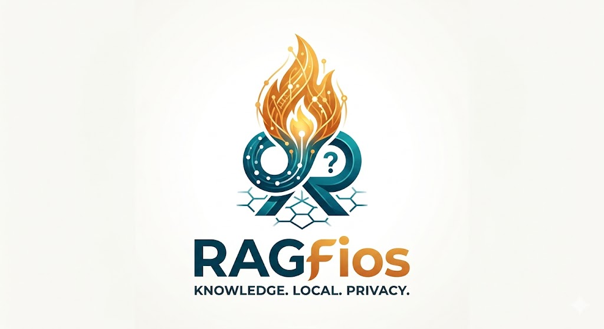

# RAGFios



> A Node.js implementation of a RAG (Retrieval-Augmented Generation) system designed for privacy, local execution, and architectural education. Built as a living laboratory for developers to master the nuances of local AI.

---

## The Vision

RAGFios bridges the gap between high-end AI capabilities and local hardware constraints. Built on the principles of Data Sovereignty and Hardware Efficiency, this project brings capable AI to local, resource-constrained devices without the need for cloud-scale infrastructure.

### Key Philosophy

* **Local-First, Hybrid-Ready:** Optimized for 4-bit Small Language Models (SLMs), with a modular architecture that allows developers to selectively integrate cloud-based LLMs when external compute is required.
* **Progressive Enhancement:** A strategic approach ensuring the system delivers high-quality responses even in constrained environments by prioritizing core reasoning logic.
* **Scalable Foundation:** Designed as a functional core, providing the essential building blocks needed to grow into larger, more complex AI-driven systems.

### Versatility & Use Cases

RAGFios is built to be a flexible core for diverse AI applications. Whether you are building a professional research tool or a personalized creative companion, the system is designed to adapt:

* **Immersive Storytelling:** Create a friendly chatbot that plays interactive games with children, utilizing long-term memory to remember every detail of their past adventures.
* **Multi-Modal Integration:** The core is easily extended. For example, you can pair RAGFios with a local **TTS (Text-to-Speech)** server and an **image generation model** to create an illustrated, narrated experience in real-time.
* **Highly Configurable:** Feel free to experiment with the **prompt configuration pools** to radically change the bot's personality and reasoning depth.

RAGFios provides the engine; you define the destination.

---

### Laboratory Notice: Production Readiness

RAGFios is a functional blueprint and experimental laboratory, not a production-hardened system. While it adheres to rigorous architectural standards (DDD/TypeScript), it is built to allow developers to explore and "deconstruct" the various facets of a RAG system locally.

**Current Focus Areas:**
* **Ingestion:** Currently optimized for standard PDF layouts as a foundational implementation.
* **Workload Management:** Designed for sequential local use; a queueing mechanism is currently in the Roadmap.
* **Evolutionary Design:** As a "laboratory," the API and internal structures are subject to refinement as new patterns emerge.

---

## Key Features

* **Deterministic and Non-deterministic Guardrails:** Multi-layered safety to ensure output reliability.
* **Routing and Classification:** Intelligently decides if the retriever is necessary for a specific query.
* **Query Rewriting and Validation:** Built-in logic to refine user intent for higher retrieval accuracy.
* **Context Management:** Strategic compression and summarization to optimize token usage.
* **Document Reranking:** Precision filtering to ensure only the most relevant context reaches the model.
* **Configurable Orchestration:** A dynamic engine that reads profiles and connects to multiple providers concurrently.

---

## Architecture and Tech Stack

RAGFios is built with TypeScript to provide a strictly typed, reliable environment. A core design goal is the elimination of Python dependencies, providing a streamlined, native Node.js experience.

### Architectural Rigor (DDD)

The system is engineered for long-term stability using Domain-Driven Design (DDD) principles. Logic is divided into two primary Bounded Contexts:

* **Chat and Orchestration:** Manages the reactive flow of user interactions, coordinating communication between guardrails, rerankers, and LLM providers.
* **Document Ingestion:** A dedicated service focused on extracting data from PDFs and transforming it into optimized vector embeddings.

### Plug-and-Play Providers

Using an adapter-based pattern, RAGFios allows you to swap local defaults for enterprise solutions (e.g., Pinecone, PostgreSQL) without refactoring core domain logic:

* **Vector Database:** Vectra (Default) — In-memory for fast local retrieval.
* **Relational Database:** better-sqlite3 (Default).

### A Note on Semantic Integrity

In this initial release, the Embedding Implementation is intentionally coupled with the Vector Store. This is a deliberate design choice to ensure Vector Space Consistency.

By maintaining a fixed embedding-to-storage pipeline, we prevent "Semantic Mismatch"—a common issue where changing embedding models mid-project renders existing vector data unretrievable.

**Roadmap:** Decoupling the embedder is planned for a future release, which will include a versioning layer to safely manage and migrate between different vector spaces.

---

## Getting Started

### 1. Prerequisites

* **Node.js:** version 24.3.0 or higher.
* **Local Inference Engine:** An active server to host your models. RAGFios supports LM Studio, Ollama, or any OpenAI-compatible local API.

### 2. Hardware and Models

* **Memory:** Minimum 8GB of VRAM.
* **Primary Models:** 4-bit quantized models (e.g., Llama 3, Mistral, Gemma 3).
* **Auxiliary Models (Optional):** 2-bit models (optimized for speed during classification tasks).

### 3. Installation

```bash
# Install dependencies
npm install

# Run in development mode
npm run dev
```

Note: To avoid initial latency, ensure your LLM provider is already running. This prevents delays caused by model loading during the first interaction.

---

## Profile Configuration

RAGFios offers granular control through Profile Configurations, making it an ideal environment for Prompt Engineering. Developers can create pools of configurations that can be reused or replaced based on the use case.

Default Profile: `src/infrastructure/ai/models/default.json`

| Property | Description |
| :--- | :--- |
| **lm.chat** | Primary inference engine for generating final responses. |
| **lm.classification** | Engine dedicated to query intent classification and routing. |
| **lm.queryRewrite** | Engine used for validating and rewriting user queries. |
| **prompts** | Specialized logic for Summarization, Intent Safety, and Reranking. |

You might want to use this project for different things like a friendly chat bot that play games with your daughter and remembers everything she says and answer based on this information. Feel free to play with prompot configuraton. For instance, I did exactly the same thing and also integrate it with a TTSS server and image generating local modal that generate images in the middle of the adventure. You have the core, you define what to do. 

## 🧠 Memory & Context Management

To support long-running conversations on limited hardware, RAGFios utilizes an aggressive history management strategy.

### Automated Compression
The system automatically manages your conversation history by **summarizing and archiving messages** during long sessions. This ensures the model maintains context without exceeding memory limits or slowing down performance on constrained systems.

### Context Window Configuration
You can fine-tune VRAM usage via the `lm.chat.maxContextSize` property. 

* **Default Value:** `32768` tokens.
* **Optimized for 16GB VRAM or less:** We recommend lowering this value to `4096` to prevent Out-of-Memory (OOM) errors.

> [!IMPORTANT]
> **Respect Model Limits:** Never set this value higher than the model’s native maximum context size. For example, `gemma-4-e4b-it` supports a maximum window of `131072` tokens.
---

## Guardrails

RAGFios supports both deterministic (Regex/Logic) and non-deterministic (Model-based) guardrails. They operate via a Chain of Responsibility pattern within a well-defined lifecycle:

```typescript
export const GuardEvents = {
    BEFORE_INPUT: 'before_input',
    AFTER_RETRIEVAL: 'after_retrieval',
    BEFORE_GENERATION: 'before_generation',
    STREAM_CHUNK: 'stream_chunk',
    AFTER_GENERATION: 'after_generation'
} as const;
```

### Guard Execution Model

* **Sequential Processing:** Each guard in the chain processes input in order.
* **Collection Handling:** Use CollectionGuard when working with lists (e.g., redacting information from multiple retrieved documents).

---

## ⚖️ Credits & Legal

**RAGFios** is built upon the shoulders of incredible open-source projects. Special thanks to the creators and maintainers of:

- **[better-sqlite3](https://github.com/WiseLibs/better-sqlite3)** — Licensed under the MIT License. (c) 2017 Joshua Wise.
- **[vectra](https://github.com/StevenIckman/vectra)** — Licensed under the MIT License. (c) 2023-2026 Steven Ickman.

> "Special thanks to all the legends of the open-source community. I may not know all your names, but I certainly know—and value—your creations."

This project is licensed under the **MIT License**. See the `LICENSE` file in the root directory for full details.

Copyright (c) 2026 [Flavio Almeida]

## Special Acknowledgement: Google & The Gemma Team

**RAGFios** was born and bred on **Gemma 3** and updated to **Gemma 4**

While the system is designed to be model-agnostic, the core orchestration logic, prompt engineering "pool," and guardrail benchmarks were specifically tuned using **gemma-4-e4b-it (GGUF)**. This project owes its reasoning depth and local efficiency to the architectural breakthroughs made by the Google Gemma team.

> "To the team at Google: Thank you for providing the open weights that make local, private, and high-performance RAG possible for developers everywhere. We are already looking forward to pushing the boundaries of what's possible with Gemma 4."

---

## TODOs and Future Improvements

* [x] Model Optimization: Expand the Configuration Pool with presets tuned for Gemma 4.
* [ ] Asynchronous Task Management:
    * Phase 1: Implement an in-memory Node.js queue for zero-dependency local use.
    * Phase 2: Transition to a Redis-backed architecture for persistent, distributed scaling.
* [ ] Multi-modal Output (TTS): Create a unified Text-to-Speech (TTS) interface to switch between local servers (privacy) and cloud providers (fidelity).
* [ ] Expanded Ingestion: Add native Markdown (.md) support for documentation-based retrieval.
* [ ] Architectural Decoupling: Refactor the Embedding Service into a standalone module (requiring developer-provided tokenizers).
* [ ] Internationalization: Move LLM-generated guard messages to a key-based translation system for the front-end.
* [ ] Efficiency Research: Benchmark performance on 2-bit quantized models to explore the lower limits of local reasoning.